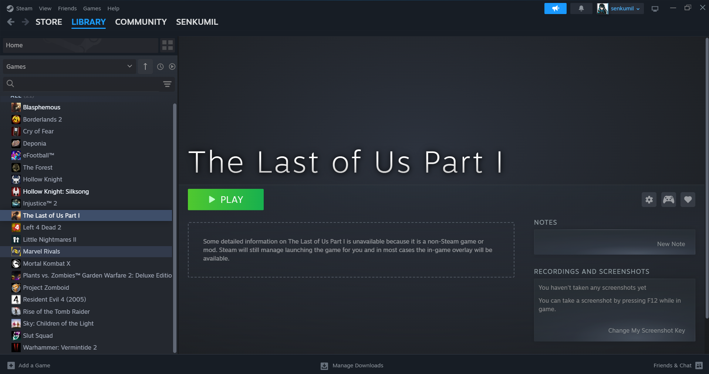
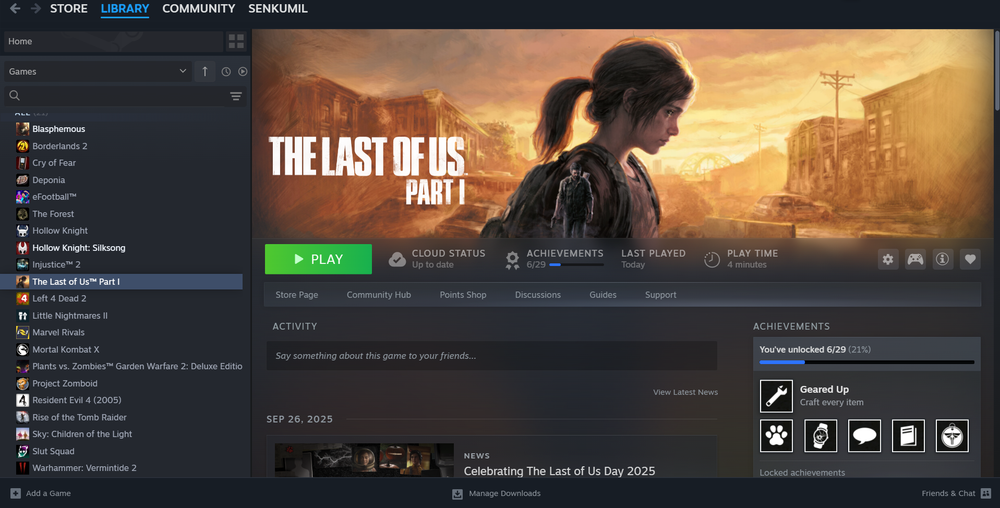
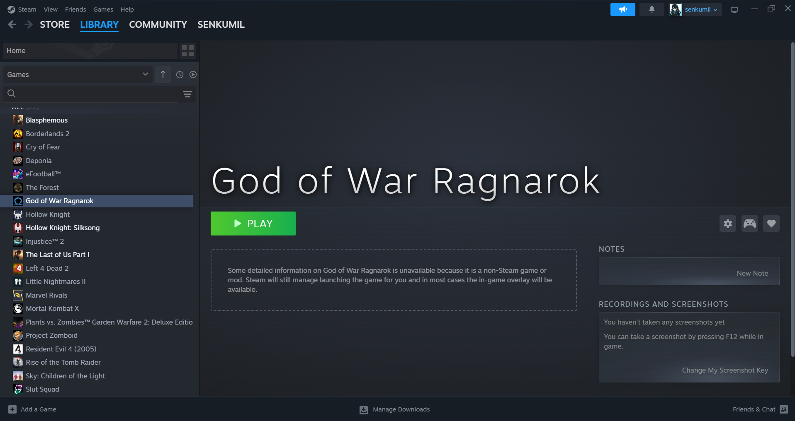
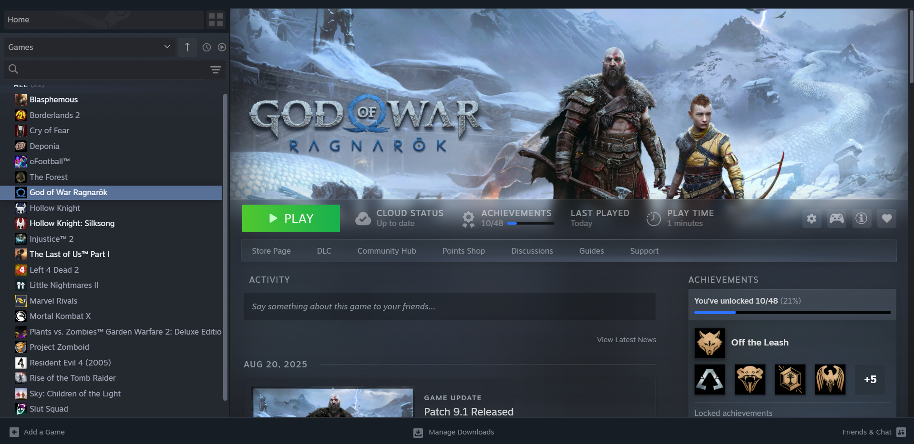
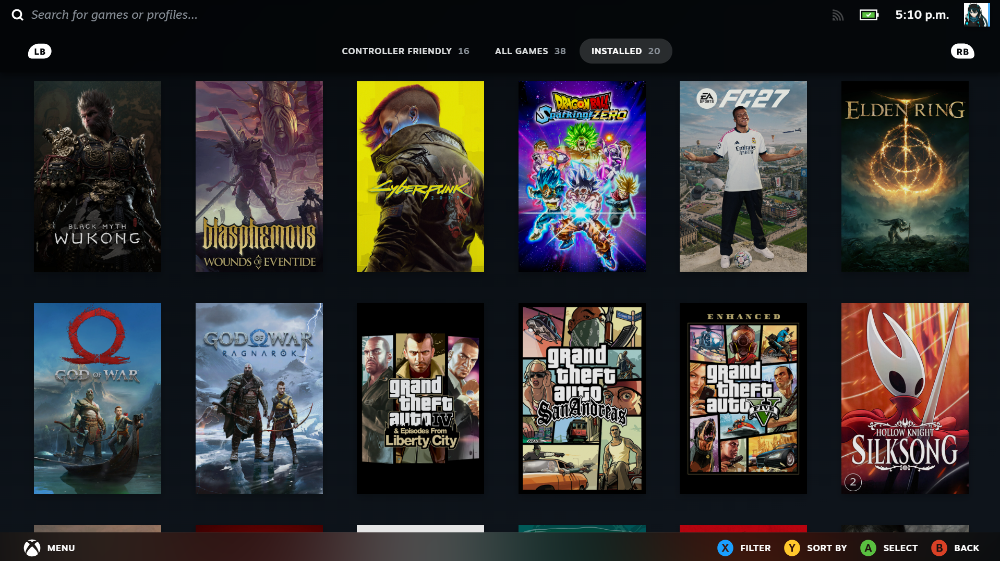
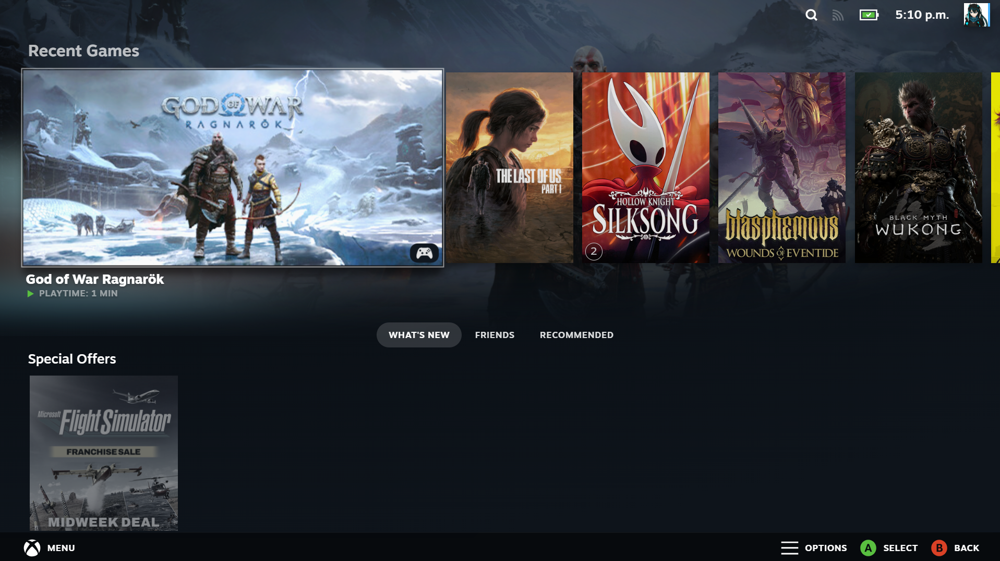

# GameBridge for Steam

**English** · [Español](README_ES.md)

**Bring the complete Steam Library experience to your non-Steam games.**

GameBridge for Steam is a [Millennium](https://steambrew.app/) plugin that links a non-Steam shortcut to its real Steam AppID and rebuilds its Library page with official metadata, artwork, activity, achievements, community content, playtime, and native-style controls.

Once linked, an external game no longer feels like an empty shortcut: it receives the identity and presentation of its Steam release while continuing to launch the executable you originally added.

> GameBridge changes the local presentation of linked shortcuts. It does not grant Steam ownership, licenses, inventory items, Steam Cloud storage, or official profile achievements.

---

## ✨ Highlights

- Automatic game detection with reviewable candidates, confidence scores, and cover previews.
- Automatic official title, icon, portrait, hero background, transparent logo, logo position, and wide capsule.
- Native-style Library page with activity, news, achievements, game information, community content, friends, cards, DLC, Workshop, notes, and primary links.
- Big Picture presentation that treats linked shortcuts as native entries and removes the redundant **Non-Steam** category.
- Local achievement progress with live unlock notifications and optional SteamAutoCrack/Goldberg integration.
- Native Steam playtime when available, with an optional persistent fallback tracker.
- SteamGridDB fallback for individual artwork assets that Steam does not provide.
- UI localization based on the active Steam client language, with safe English fallbacks.
- Strict isolation: only explicitly linked non-Steam shortcuts are modified; native Steam games are left alone.

---

## 🎮 A Native-Style Steam Library Experience

GameBridge reconstructs the useful surfaces normally missing from a non-Steam shortcut:

- **Steam-style play bar** with Play, Cloud status presentation, last session, total playtime, achievement progress, game information, controller, and favorite controls.
- **Official navigation links** for the Store page, DLC, Community Hub, Points Shop, Discussions, Guides, Workshop, and Support when available.
- **Game information drawer** with cover art, description, developer, publisher, franchise, release date, player modes, controller support, family sharing, Steam Cloud capability, and other Store features.
- **Activity and news feed** combining Steam partner events, announcements, major updates, patch notes, hotfixes, offers, events, DLC releases, and community posts in chronological order.
- **Status composer** with emoticons and a shortcut-specific activity history.
- **Friends who play** with Steam personas, avatars, recent playtime, reviews, screenshots, videos, and related activity when Steam exposes the information.
- **Community Content** with screenshots, artwork, and guides loaded progressively for faster initial rendering.
- **Achievement sidebar and modal** with unlocked/locked groups, progress, descriptions, dates, global percentages, and native-style artwork.
- **Trading-card presentation** using official Steam Community/Market artwork, badge information, card collection layout, centered 3D interaction, cursor lighting, and subtle foil reflection when foil metadata is available.
- **Optional DLC and Workshop sections** validated against the linked Steam AppID.
- **Steam Notes and media areas remain available** alongside the injected content.

The page renders cached core information immediately and hydrates network-backed sections independently, so a temporary Store, Community, or IPC failure does not permanently leave the game empty until Steam restarts.

---

## 📸 Screenshots

These captures show the visual difference between an unlinked shortcut and a linked game, plus the achievement/feed surfaces and Big Picture integration.

<p align="center">
  
  
</p>
<p align="center"><em>The Last of Us Part I · Before linking · After linking</em></p>

<p align="center">
  
  
</p>
<p align="center"><em>God of War Ragnarök · Before linking · After linking</em></p>

<p align="center">
  
  
</p>
<p align="center"><em>Big Picture library · Big Picture recent games and playtime</em></p>

---

## 🔍 Smart Automatic Detection and Linking

When a newly added non-Steam shortcut is opened, GameBridge can suggest the most likely Steam release automatically.

The detector evaluates multiple signals instead of trusting the shortcut name alone:

- Executable name and full executable path.
- Parent folders and install-directory identity.
- `steam_appid.txt`, launch arguments, manifests, and other direct Steam evidence.
- Known official executable names and verified aliases.
- Unreal Engine targets such as `Win64-Shipping.exe`.
- Generic launchers and bootstrap executables, which are treated more cautiously.
- Store candidates and edition differences, with an ambiguity gap between results.

The confirmation window displays candidate names, Steam AppIDs, confidence values, and covers before anything is changed. You can select another candidate, reject the suggestion, or enter an AppID manually from the shortcut's **Properties** window.

After confirmation, GameBridge:

1. Saves a stable mapping for the shortcut.
2. Renames it to the official Steam title.
3. Applies the official icon and Library artwork.
4. Preserves the original launch target.
5. Can replace a short-lived launcher with the detected long-running game executable so playtime remains accurate.
6. Finishes the identity and artwork work safely in the background even if the Properties window is closed.

---

## 🖼️ Automatic Artwork and Correct Native Placement

GameBridge prioritizes resources published by Steam and applies them using Steam's expected Library slots and proportions:

- **Portrait grid** (`600 × 900`) for collections and shelves.
- **Hero background** (`1920 × 620`) for the Library details header.
- **Transparent logo**, including Steam's official logo-position metadata when published.
- **Wide capsule** (`920 × 430`) for recent games and carousel surfaces.
- **Official shortcut icon** resolved from current and legacy Steam asset sources.

The artwork process reports whether every resource was applied successfully and identifies missing assets. Official Steam artwork is never replaced automatically by community artwork.

### SteamGridDB fallback

If Steam does not publish a particular portrait, hero, logo, or capsule, GameBridge can request only that missing resource from [SteamGridDB](https://www.steamgriddb.com/). Selection prefers the correct Steam AppID, asset type, dimensions, transparency, language, and appropriate visual style while rejecting unsafe provider domains.

Enter your own SteamGridDB API key in GameBridge settings and enable the automatic fallback. The key is stored only in the local Steam/Millennium browser context; it is not bundled with the plugin or sent to GameBridge servers. Other injected code sharing that browser context may be able to access local storage, so never publish a shared key.

---

## 🖥️ Big Picture Integration

For linked shortcuts, GameBridge adapts the local Big Picture data model so the games are presented like regular Steam Library entries:

- Linked games are no longer separated into a **Non-Steam**, **Outside Steam**, or equivalent localized category.
- The redundant non-Steam category is hidden when it becomes empty.
- Installed state, controller presentation, compatibility fields, and playtime are exposed to the Big Picture interface.
- The behavior is limited to mapped shortcuts and is restored when the plugin or Big Picture integration is unloaded.

This is a local UI integration. It does not convert the shortcut into an owned Steam license or bypass Steam ownership checks.

---

## 🏆 Local Achievements and Unlock Notifications

GameBridge combines Steam's achievement metadata and icons with a local `achievements.json` progress file. When the file changes while you play, the plugin can update the Library page and display Steam-style unlock notifications with sound.

Available achievement features include:

- Total and unlocked counters in the play bar and sidebar.
- Progress bars, unlocked and locked groups, icons, descriptions, and unlock dates.
- Full achievement modal with native-style filtering and global unlock percentages when available.
- Live monitoring of local progress files.
- Achievement unlock toast and sound.
- A settings button for testing achievement notifications.
- Optional deterministic test achievements for interface testing when no progress file exists; disabled by default.

### Configure an achievement file

GameBridge reads achievement files without modifying them. The default GSE Saves layout is:

```text
%APPDATA%\GSE Saves\<AppID>\achievements.json
```

You can configure the source in either of these ways:

1. **Global folder:** Open GameBridge settings and select a base folder containing one subfolder per Steam AppID.
2. **Per-game override:** Right-click the shortcut → **Properties** → **Linked Game** and select an exact `achievements.json` file or a folder containing it.
3. **Automatic AppID lookup:** Leave the per-game path on automatic to search GSE Saves, supported Goldberg locations, and configured global folders for the linked AppID.

### Using SteamAutoCrack / Goldberg

Games that do not natively create a compatible local progress file need an external emulator or achievement generator. GameBridge includes guidance for [SteamAutoCrack](https://github.com/SteamAutoCracks/Steam-auto-crack/releases), which can configure Goldberg Emulator and generate the AppID folders and `achievements.json` file as achievements are earned.

Typical setup:

1. Configure the game with SteamAutoCrack/Goldberg according to that project's documentation.
2. Make sure it generates `achievements.json` under a folder associated with the correct Steam AppID.
3. Point GameBridge's global achievement folder or per-game override to that location.
4. Launch the game through the linked Steam shortcut.
5. Use **Test achievement notification** in GameBridge settings to verify the toast and sound independently.

SteamAutoCrack and Goldberg Emulator are external projects and are not bundled with or maintained by GameBridge. Use them only with software you are legally permitted to configure. Local unlocks are for the GameBridge interface and do not unlock official Steam profile achievements.

---

## ⏱️ Playtime and Session Tracking

### Steam Beta or the GameBridge fallback?

Steam Beta builds that include native non-Steam playtime tracking are recommended if you want Steam itself to measure and display the shortcut's local playtime. You can opt in from **Steam → Settings → Interface → Client Beta Participation → Steam Beta Update**.

GameBridge checks whether the current Steam client already exposes native playtime for each linked shortcut. When it does, the plugin uses Steam's value and does not create a duplicate counter. When it does not, GameBridge automatically activates its own local fallback tracker. The fallback is enabled by default and can be disabled in GameBridge settings.

The fallback can:

- Detect when a linked external game starts and stops.
- Persist sessions across shortcut title changes and regenerated shortcut IDs.
- Display lifetime playtime in the desktop Library and Big Picture.
- Keep aliases and canonical shortcut identity synchronized.
- Recover cleanly from overlapping or interrupted sessions.

### ⚠️ Critical Requirement: Main Game Executable vs. Launchers

> [!IMPORTANT]
> **Point directly to the original game executable:**
> For playtime tracking and session detection to function accurately (both via Steam's native tracker and through the GameBridge fallback), the Steam shortcut must target the **original, main game executable**—the `.exe` binary that stays open and actively running throughout your entire play session.
> 
> **Why doesn't it work with launchers or intermediary executables?**
> If you add an external launcher, bootstrap tool, script, or intermediary wrapper `.exe` that merely boots up the actual game and then immediately exits, Steam and the process monitor will assume the session finished in a few seconds, prematurely stopping the timer and leaving playtime unrecorded.
> 
> If a game uses a separate launcher, locate the actual long-running game executable inside the installation directory (for example, Unreal Engine titles typically place it under `Binaries/Win64/...-Shipping.exe`) and set it as the shortcut target in Steam. During the linking workflow, GameBridge will also attempt to identify and suggest this real executable automatically.

---

## 🎴 Trading Cards, Badges, DLC, and Workshop

When the Steam release exposes the corresponding data, GameBridge adds optional native-style sidebar sections:

- Official trading-card artwork sourced from Steam Community and the Community Market.
- Badge artwork, experience presentation, collected/remaining counts, and a responsive card grid.
- Interactive card enlargement with bounded 3D tilt, directional brightness, cursor glow, and foil-only holographic reflection.
- Validated DLC covers and Store links.
- Workshop preview and navigation when the title supports Steam Workshop.

These sections recreate the Library presentation only. GameBridge does not award cards, badges, XP, DLC ownership, or Steam inventory items.

---

## 🌐 Multilingual Interface

GameBridge automatically detects the active Steam client language and localizes the injected interface to match it. Library headings, navigation links, achievements, activity labels, community sections, game information, tooltips, and native controls reuse Steam's official localization tokens whenever they are available.

Plugin-specific windows, detection messages, settings, and linking results use GameBridge's localization catalog. Spanish is included directly, while English provides the safe fallback for text that Steam does not translate. Changing the Steam client language refreshes the localized data and interface without requiring a separate plugin edition.

---

## 📥 Installation

1. Install [Millennium](https://steambrew.app/) for Steam.
2. Download the latest GameBridge for Steam release.
3. Place the plugin folder in:

   ```text
   <Steam>\millennium\plugins\GameBridge for Steam
   ```

4. Restart Steam.
5. Enable **GameBridge for Steam** in Millennium's Plugins page.

---

## 🚀 Quick Start

1. In Steam, choose **Games → Add a Non-Steam Game to My Library...** and add the **main game executable** (avoid selecting launchers or intermediary executables to ensure accurate playtime tracking).
2. Open the new shortcut in your Library.
3. Review the automatic detection modal and choose **Link game**.
4. Wait for the success report confirming the title, icon, and artwork that were applied.
5. The linked Library page will populate with the available Steam information and optional sections.

If automatic detection is uncertain or unavailable:

1. Right-click the shortcut and open **Properties**.
2. Under **Linked Game**, review the visual candidates or paste a Steam AppID/Store URL.
3. Choose the correct release and press **Save**.

---

## 🛠️ Building from Source

The repository includes the production bundle at `.millennium/Dist/index.js`.

```bash
# Install dependencies
npm install

# Run TypeScript, architecture, localization, detection, and Lua checks
npm run check

# Build the production bundle
npm run build

# Run every check and validate the generated bundle
npm run verify
```

Backend changes under `backend/` take effect after restarting Steam.

---

## ☕ Support the Project

If GameBridge for Steam has improved your library, you can support its continued development, testing, localization, and maintenance on [Ko-fi](https://ko-fi.com/senkumil). Every contribution is appreciated and helps keep the project moving forward.

---

## 📄 License

MIT License — see [LICENSE](LICENSE) for details.


